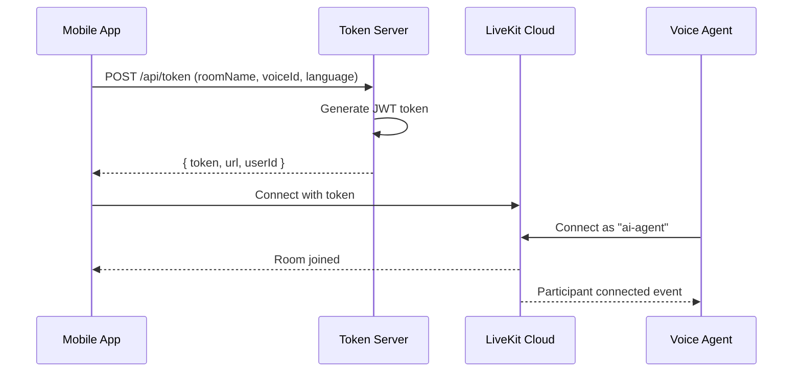

# System Architecture

## Overview

The Soulmate AI system consists of three main components working together to create a real-time voice conversation experience.

---

## Component Diagram

```
┌────────────────────────────────────────────────────────────────┐
│                        MOBILE APP                               │
│  ┌──────────────────────────────────────────────────────────┐  │
│  │  React Native (Expo)                                      │  │
│  │  ├── VoiceChatScreen.js    (UI + animations)             │  │
│  │  ├── useLiveKit.js         (LiveKit hook)                │  │
│  │  └── @livekit/react-native (SDK)                         │  │
│  └──────────────────────────────────────────────────────────┘  │
└────────────────────────────────────────────────────────────────┘
                              │
                              │ 1. WebRTC Connection
                              │ 2. Audio Streams (bidirectional)
                              │ 3. Data Channel (transcripts)
                              ▼
┌────────────────────────────────────────────────────────────────┐
│                     LIVEKIT CLOUD                               │
│  ┌──────────────────────────────────────────────────────────┐  │
│  │  wss://meet-app-xxxxx.livekit.cloud                       │  │
│  │  ├── Room Management                                      │  │
│  │  ├── Participant Tracking                                 │  │
│  │  ├── Audio Routing                                        │  │
│  │  └── WebRTC Signaling                                     │  │
│  └──────────────────────────────────────────────────────────┘  │
└────────────────────────────────────────────────────────────────┘
                              │
                              │ Audio Frames (PCM 48kHz)
                              ▼
┌────────────────────────────────────────────────────────────────┐
│                      NODE.JS AGENT                              │
│  ┌──────────────────────────────────────────────────────────┐  │
│  │  agent.js - Voice Pipeline                                │  │
│  │                                                           │  │
│  │  ┌─────────┐   ┌─────────┐   ┌─────────┐   ┌─────────┐   │  │
│  │  │   VAD   │ → │   STT   │ → │   LLM   │ → │   TTS   │   │  │
│  │  │ (local) │   │Deepgram │   │ Gemini  │   │ElevenLab│   │  │
│  │  └─────────┘   └─────────┘   └─────────┘   └─────────┘   │  │
│  │       ↑                           ↑                       │  │
│  │       │                           │                       │  │
│  │  ┌─────────┐              ┌───────────────┐              │  │
│  │  │Interrupt│              │  RAG Pipeline │              │  │
│  │  │Detection│              │  (Memory)     │              │  │
│  │  └─────────┘              └───────────────┘              │  │
│  └──────────────────────────────────────────────────────────┘  │
└────────────────────────────────────────────────────────────────┘
```

---

## Data Flow

### Phase 1: Connection Setup



<details>
<summary>Token Generation Code</summary>

```javascript
// server.js
const token = new AccessToken(API_KEY, API_SECRET, {
  identity: uniqueUserId,
  metadata: JSON.stringify({
    language: req.body.language,
    voiceId: req.body.voiceId,
    languageName: req.body.languageName
  })
});

token.addGrant({
  room: roomName,
  roomJoin: true,
  canPublish: true,
  canSubscribe: true
});
```

</details>

---

### Phase 2: Voice Processing Loop

```
┌──────────────────────────────────────────────────────────────┐
│                    VOICE PROCESSING LOOP                      │
│                                                               │
│  ┌─────────┐    ┌─────────┐    ┌─────────┐    ┌─────────┐   │
│  │  User   │    │  VAD    │    │ Buffer  │    │  STT    │   │
│  │ Speaks  │ →  │ Detects │ →  │ Audio   │ →  │ Convert │   │
│  │         │    │ Speech  │    │ Frames  │    │ to Text │   │
│  └─────────┘    └─────────┘    └─────────┘    └─────────┘   │
│                                                      │        │
│                                                      ▼        │
│  ┌─────────┐    ┌─────────┐    ┌─────────┐    ┌─────────┐   │
│  │  Play   │    │  TTS    │    │   LLM   │    │   RAG   │   │
│  │ Audio   │ ←  │ Convert │ ←  │ Generate│ ←  │ Hydrate │   │
│  │         │    │ to Audio│    │ Response│    │ Context │   │
│  └─────────┘    └─────────┘    └─────────┘    └─────────┘   │
│                                                               │
└──────────────────────────────────────────────────────────────┘
```

<details>
<summary>Processing Loop Code</summary>

```javascript
// agent.js - Main processing loop
for await (const frame of audioStream) {
  // 1. VAD: Check for speech
  const audioData = voiceProcessor.processFrame(frame, isProcessing);

  if (audioData && !isProcessing) {
    isProcessing = true;

    // 2. STT: Convert speech to text
    const transcript = await transcribe(audioData, sampleRate, language);

    // 3. RAG: Get context from memory
    // 4. LLM: Generate response
    const response = await getAIResponseWithRAG(userId, transcript, language);

    // 5. TTS: Convert response to speech
    await synthesizeAndPlayChunked(response, language, voiceId, audioSource);

    isProcessing = false;
  }
}
```

</details>

---

### Phase 3: Barge-In (Interruption)

```
┌──────────────────────────────────────────────────────────────┐
│                    BARGE-IN FLOW                              │
│                                                               │
│  ┌─────────────────────────────────────────────────────────┐ │
│  │ AI Speaking (TTS playing audio frames)                   │ │
│  └─────────────────────────────────────────────────────────┘ │
│                           │                                   │
│                           │ User starts speaking              │
│                           ▼                                   │
│  ┌─────────────────────────────────────────────────────────┐ │
│  │ VAD Detects Speech (RMS > 50, 1 frame)                  │ │
│  └─────────────────────────────────────────────────────────┘ │
│                           │                                   │
│                           │ shouldInterrupt = true            │
│                           ▼                                   │
│  ┌─────────────────────────────────────────────────────────┐ │
│  │ AbortController.abort() → Cancel TTS API call           │ │
│  └─────────────────────────────────────────────────────────┘ │
│                           │                                   │
│                           │ Save interrupted context          │
│                           ▼                                   │
│  ┌─────────────────────────────────────────────────────────┐ │
│  │ Process new user input with context re-shaping          │ │
│  └─────────────────────────────────────────────────────────┘ │
│                                                               │
└──────────────────────────────────────────────────────────────┘
```

---

## Technology Choices

### Why LiveKit?

| Requirement | Solution |
|------------|----------|
| Low latency audio | WebRTC (UDP, <100ms) |
| Scalable infrastructure | LiveKit Cloud |
| Cross-platform | SDKs for React Native, Web |
| Data channel | Transcript delivery |

### Why This Stack?

| Component | Technology | Why? |
|-----------|------------|------|
| STT | Deepgram Nova-2 | Fastest, most accurate, multilingual |
| LLM | Gemini Flash | Fast, cheap, 1M context window |
| TTS | ElevenLabs Flash | Natural voice, lowest latency model |
| Memory | Firestore + Vertex AI | Scalable, semantic search |
| Frontend | React Native | Cross-platform mobile |

---

## Environment Variables

```env
# LiveKit (WebRTC infrastructure)
LIVEKIT_URL=wss://your-project.livekit.cloud
LIVEKIT_API_KEY=APIxxxxx
LIVEKIT_API_SECRET=your-secret

# Voice Pipeline APIs
VITE_DEEPGRAM_API_KEY=your-deepgram-key
VITE_GEMINI_API_KEY=your-gemini-key
VITE_ELEVENLABS_API_KEY=your-elevenlabs-key

# Firebase/Google Cloud (Memory)
FIREBASE_PROJECT_ID=your-project-id
GOOGLE_APPLICATION_CREDENTIALS=./serviceAccountKey.json
VERTEX_AI_LOCATION=asia-south1
```

---

## Related

- [[02-Voice-Pipeline]] - Detailed STT/LLM/TTS flow
- [[03-Barge-In]] - Interrupt detection system
- [[05-Memory-RAG]] - How memory works

#architecture #system-design #livekit #webrtc
